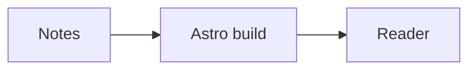
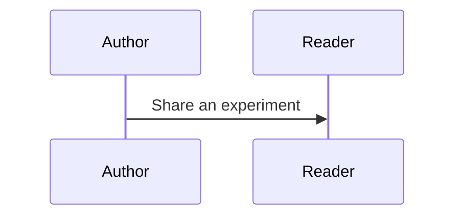

# Getting started

This guide targets `@tcitry/astro-book` 0.1.0 with Astro 7.3.1 or a compatible Astro 7 release. Use Node.js 22.12 or newer. All examples use public package imports; they need no account or private content.

[README](../README.md) · [中文说明](../README.zh-CN.md) · [Public API](architecture.md) · [Development and upgrades](development.md)

## 1. Install the package

There is no published npm release yet. Clone this repository, run `npm ci`, then `npm run pack:theme`. Copy the generated `tcitry-astro-book-0.1.0.tgz` into your Astro site's root and install it there:

```sh
npm install ./tcitry-astro-book-0.1.0.tgz
```

For a new site, create a directory with this `package.json`, copy the tarball into it, then run the install command above:

```json
{
  "name": "my-book-site",
  "private": true,
  "type": "module",
  "scripts": {
    "dev": "astro dev",
    "build": "astro build",
    "preview": "astro preview",
    "check": "astro check"
  },
  "dependencies": { "astro": "7.3.1" },
  "devDependencies": {
    "@astrojs/check": "0.9.10",
    "typescript": "6.0.3"
  }
}
```

Add `tsconfig.json`:

```json
{
  "extends": "astro/tsconfigs/strict",
  "include": [".astro/types.d.ts", "**/*"],
  "exclude": ["dist"]
}
```

## 2. Enable Markdown and MDX

Create `astro.config.mjs`:

```js
import { defineConfig } from 'astro/config';
import astroBook from '@tcitry/astro-book';

export default defineConfig({
  site: 'https://example.org',
  output: 'static',
  trailingSlash: 'always',
  integrations: [astroBook({
    markdown: {
      math: { macros: { '\\RR': '\\mathbb{R}' } },
    },
  })],
});
```

Replace `site` with your canonical production origin. `astroBook()` configures one shared pipeline and adds MDX when absent. It does not create routes or load content. Configure it once; add custom imported remark/rehype/recma plugin functions through its `markdown` option. An existing MDX integration should retain its default Markdown inheritance. Use `mdx: false` if the site only needs Markdown.

## 3. Create a reading layout

Create `src/layouts/Article.astro`:

```astro
---
import BookLayout from '@tcitry/astro-book/components/BookLayout';
import type { BookHeading, NavigationItem } from '@tcitry/astro-book/types';

interface Props {
  frontmatter?: { title?: string; description?: string };
  headings?: BookHeading[];
}
const { frontmatter = {}, headings = [] } = Astro.props;
const title = frontmatter.title ?? 'My notebook';
const navigation: NavigationItem[] = [
  { id: 'home', label: 'Home', href: '/' },
  { id: 'experiment', label: 'An MDX experiment', href: '/experiment/' },
].map((item) => ({ ...item, active: item.href === Astro.url.pathname }));
---
<BookLayout
  site={{ title: 'My notebook', home: '/', lang: 'en' }}
  page={{ title, url: Astro.url.pathname, description: frontmatter.description, headings }}
  navigation={navigation}
  seo={{ canonical: new URL(Astro.url.pathname, Astro.site).href }}
  search={false}
  theme="auto"
>
  <Fragment slot="navigation-after">
    <label for="reading-theme">Appearance</label>
    <select id="reading-theme" data-book-theme-select>
      <option value="auto">System</option>
      <option value="light">Light</option>
      <option value="dark">Dark</option>
    </select>
  </Fragment>
  <article class="markdown" data-pagefind-body>
    <h1 data-pagefind-meta="title">{title}</h1>
    <slot />
  </article>
</BookLayout>
```

The theme selector is connected by the layout's runtime. The selected preference is stored locally and takes precedence over the layout's initial `theme` value. Mermaid and code colors follow the reading theme.

Astro Markdown/MDX pages supply `frontmatter` and `headings` to this layout. For an `.astro` page or a custom content loader, pass headings yourself; each heading needs `depth`, `slug` and `text`, with a matching ID in the rendered content. Set `page.toc: false` to hide the right column and mobile TOC. `page.bodyClass: 'book-page-wide'` selects the wider presentation layout.

## 4. Add Markdown and MDX pages

Create `src/pages/index.md`:

````md
---
layout: ../layouts/Article.astro
title: My notebook
description: Notes, diagrams and interactive experiments.
---

## Mathematics

Inline math: $E = mc^2$ and $x \in \RR$.

$$
\int_0^1 x^2\,dx = \frac{1}{3}
$$

## Diagram



## Code

```ts
const greeting = 'Hello, reader';
```
````

Create `src/pages/experiment.mdx`:

````mdx
---
layout: ../layouts/Article.astro
title: An MDX experiment
---

import Notice from '@tcitry/astro-book/components/Notice';

## Components in an article

<Notice>An Astro component inside MDX needs no React renderer.</Notice>

The same math configuration works here: $x \in \RR$.


````

Run `npm run dev` and open the local URL printed by Astro. Use `npm run check` and `npm run build` to validate the starter, then `npm run preview` to inspect the static output.

KaTeX renders during the build and uses packaged fonts. Invalid math keeps readable error source by default; `markdown.math.throwOnError: true` makes it a build failure. Use `math: false` to disable math or `math: { singleDollarTextMath: false }` to disable inline dollar notation. Escape literal currency dollars as `\$`. KaTeX handles mathematics syntax, not complete LaTeX documents.

Mermaid loads on pages containing diagrams. Wide diagrams scroll locally, and errors preserve the diagram source. Set integration options such as `mermaid: { flowchart: { useMaxWidth: false } }`; a layout's `mermaid` prop can override runtime options. `mermaid: false` disables diagrams at the relevant integration/layout level. Do not add a second Mermaid initializer or KaTeX stylesheet.

Code fences use **Expressive Code 0.44.2**: static Shiki colors, optional titles/line markers and the upstream copy button. `BookLayout` includes the shared CSS and clipboard module; no React island or browser highlighter is added to an ordinary article. The same pipeline covers this guide's Markdown/MDX pages and `createBookMarkdownRenderer()` for a custom importer. Do not install a second `astro-expressive-code` integration on top of `astroBook()`.

The default is a plain frame matching the reading layout. Opt into a file tab with a fence such as `` ```ts title="example.ts" frame="code" ``, or set `markdown.code.defaultProps` and `markdown.code.styleOverrides` through the integration. Light/dark themes follow the Book theme selector. Existing `markdown.shikiConfig` themes, language registrations and aliases remain supported; custom Shiki transformers retain Astro's existing highlighting and use the same official copy frame.

File-name comments and terminal comments are retained. Copy values preserve tabs, leading blank lines and trailing spaces; the library's default comment extraction and terminal-copy filtering are disabled. Mermaid copies its original source even after a diagram renders. Trusted raw HTML `<pre>` elements also receive the upstream frame; elements inside `[data-book-island]` or `[data-demo]` remain owned by their framework.


## Navigation and previous/next links

`site.menu` holds an optional top-level menu. `navigation` holds the main tree. The site supplies the ordering and active state; the theme does not infer your content hierarchy or URL policy.

```ts
import type { NavigationItem } from '@tcitry/astro-book/types';

const navigation: NavigationItem[] = [{
  id: 'guides',
  label: 'Guides',
  collapsible: true,
  children: [
    { id: 'start', label: 'Getting started', href: '/guides/start/', active: true },
    { id: 'next', label: 'Next steps', href: '/guides/next/' },
  ],
}];
```

A group containing an active descendant opens by default. Set `expanded` to choose its initial state explicitly. Links can provide `icon` and `external`; `flat` changes group presentation. Pass `previous={{ title: 'Introduction', url: '/intro/' }}` and `next={{ title: 'Next steps', url: '/next/' }}` to `BookLayout` for footer navigation. Selecting those pages remains the site's responsibility.

## Search with Pagefind

The theme supplies the search interface. Your build generates and deploys the index:

```sh
npm install --save-dev pagefind
```

Change your site's build script to:

```json
{ "build": "astro build && pagefind --site dist" }
```

Replace `search={false}` on the layout with:

```astro
search={{ basePath: '/pagefind', placeholder: 'Search notes' }}
```

Keep `data-pagefind-body` on the article to index its content. The default shell excludes navigation/footer from indexing. Run `npm run build` followed by `npm run preview`: a fresh development server does not generate the search index. Deploy the generated `dist/pagefind` directory along with the HTML. For a site hosted under a path prefix, adjust `basePath` and all site links to that prefix. Search translations and optional image/sub-result display are described by `SearchConfig` in the public types.

## SEO and comments are explicit

`page.url` alone does not create a canonical link. Set the Astro `site` origin and pass the site's own SEO values to `BookLayout`:

```astro
seo={{
  title: `${title} | My notebook`,
  canonical: new URL(Astro.url.pathname, Astro.site).href,
  description: frontmatter.description,
  type: 'article',
  locale: 'en_US',
  robots: import.meta.env.PUBLIC_SITE_ENV === 'production'
    ? 'index, follow'
    : 'noindex, nofollow',
  feeds: [{ title: 'My notebook', href: '/rss.xml' }],
}}
```

This example keeps previews out of search results unless the production build explicitly sets `PUBLIC_SITE_ENV=production`. The theme renders supplied metadata; your site generates RSS/sitemap files, chooses structured data and sets deployment headers. A feed link does not generate a feed.

To add Giscus, import its component in your layout:

```astro
import Giscus from '@tcitry/astro-book/components/Giscus';
```

Place it inside `BookLayout`, after supplying the values from your own [Giscus configuration](https://giscus.app/):

```astro
<Fragment slot="comments">
  {commentsEnabled && <Giscus
    repo={giscus.repo}
    repoId={giscus.repoId}
    category={giscus.category}
    categoryId={giscus.categoryId}
    mapping="pathname"
    lang="en"
  />}
</Fragment>
```

Here `commentsEnabled` and `giscus` are site-defined data, not theme globals. The `comments` slot appears after footer navigation. Decide which pages allow comments explicitly. For an existing site using pathname mapping, preserve the exact public path, including case, encoding and trailing slash, to keep its Discussion association. Review mappings before changing URLs; the theme never edits Discussions.

## Slots and component replacements

Use slots when adding or replacing a region in one layout:

| Slot | Placement |
| --- | --- |
| `head` | Extra elements in the document head |
| `navigation-before`, `navigation`, `navigation-after` | Around/replacing the main navigation tree |
| `content-before`, default slot, `content-after` | Before, within and after main content |
| `toc` | Replaces both desktop and mobile TOC content |
| `footer` | Replaces previous/next navigation |
| `comments` | After the footer content |
| `overlays` | Near the end of the document body |

For example, add `<p slot="content-before">A site announcement.</p>` inside `BookLayout`. A `toc` slot is rendered in both desktop and mobile regions, so keep it static and avoid unique-ID controls or hydrated widgets there.

For reusable prop-compatible replacements, use `components`. This wrapper limits the default TOC to second-level headings:

```astro
---
// src/components/CompactTOC.astro
import HeadingTree from '@tcitry/astro-book/components/HeadingTree';
import type { BookHeading } from '@tcitry/astro-book/types';
interface Props { headings?: BookHeading[] }
const { headings = [] } = Astro.props;
---
<HeadingTree headings={headings} maxDepth={2} />
```

Import the wrapper in your layout and pass `components={{ TOC: CompactTOC }}`. Other replacements are `Navigation`, `Search` and `Footer`; preserve each default component's props and runtime DOM hooks. Use `labels` to translate interface text. All contracts are exported from `@tcitry/astro-book/types`; display component data is in `@tcitry/astro-book/presentation`.

## Styling and optional framework islands

The package includes complete precompiled CSS, icons and KaTeX fonts. It scans its own sources at package-build time, so consumers need no Tailwind compiler for theme components. A site that writes additional Tailwind utilities should configure its own Tailwind v4 pipeline: arbitrary consumer classes are not generated by the theme stylesheet. Prefer utilities for site additions, then CSS Modules for component-specific rules.

For design-token overrides, load a small site stylesheet after the theme stylesheet:

```css
html[data-astro-book][data-book-theme] {
  --book-content-max-width: 66rem;
  --color-link: #087e8b;
}
```

See [the styling contract](architecture.md#styles-and-framework-islands) for width and color variables. The Book compatibility styles preserve the established reading layout; you do not need to copy or rebuild their Sass in your site.

Interactive components are optional. Install the corresponding Astro renderer in the consumer, then import the component into an MDX page or a standalone Astro page:

```mdx
import InteractiveDemo from '../components/InteractiveDemo.tsx';

<div data-book-island>
  <InteractiveDemo client:visible />
</div>
```

This illustrative React component must exist in the consumer, with its React integration configured there. Svelte and Vue islands follow the same ownership boundary with their own renderers. Use `client:visible` for below-the-fold demos, or `client:load` when immediate interaction is necessary. Use `client:only="react"` for a React component that cannot render on the server, with an appropriate visible fallback. Ordinary articles do not need that framework's client bundle.

`data-book-island` keeps the theme's reading selectors and DOM enhancement scripts out of the widget. Inherited fonts/colors and your framework's own CSS still need integration testing; a marker is not full CSS isolation. WebGL/Three.js demos can also live in client components or separate pages. Keep keys and privileged service calls out of browser bundles.

For a customized shell with the complete reading behavior, reuse `BookLayout` and replace its slots or component props. The public `styles.css` and `client` imports alone do not supply every layout resource: `BookLayout` also includes the shared Expressive Code stylesheet and raw-HTML frame template. Those resources currently have no separate public subpath; do not depend on internal package paths to recreate the shell.

## Upgrade and deploy

Before adopting a new package artifact, retain the previous tarball/package reference and lockfile. Install the new artifact, run the site's checks/build, and compare representative pages and interactions. Roll back by restoring the prior dependency and lockfile and rebuilding; article sources should not need to change.

The theme builds static HTML and assets. Deploy the complete output directory to a static host; choosing domains, redirects, cache/indexing headers and host-specific CLI configuration belongs to the site. The theme does not require a server adapter or a backend. See [development and release verification](development.md) for independent package testing and future versioning.
