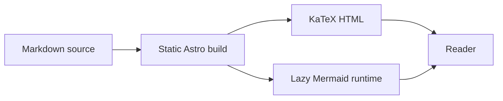

Markdown pages combine plain text with a small set of formatting conventions. This page exercises the shared renderer; dedicated guides explain [typography](../typography/), [code blocks](../code/), [mathematics](../math/) and [diagrams](../mermaid/) in more detail.

## Everyday Markdown

Use **strong**, *emphasis*, ~~deleted text~~ and `inline code` when they convey meaning. Links between these chapters are relative, so they remain beneath the site's configured base path.

- [x] Write a short example.
- [x] Check it in the built site.
- [ ] Add the next chapter.

## Formulas

Inline math is rendered during the build: $E = mc^2$. A configured macro works in $x \in \RR$.

$$
\int_0^1 x^2\,dx = \frac{1}{3}
$$

Long formulas scroll within their container on small screens:

$$
f(x_1,x_2,x_3,x_4,x_5,x_6,x_7,x_8)=\sum_{i=1}^{8}x_i^2+\prod_{i=1}^{8}(1+x_i)+\frac{\partial^2 f}{\partial x_1\partial x_2}+\frac{\partial^2 f}{\partial x_3\partial x_4}
$$

An intentional invalid command stays readable instead of breaking the page: $\unknowncommand{x}$.

## Diagrams



This deliberately invalid diagram demonstrates source fallback:

```mermaid
flowchart LR
  A[Unclosed label --> B
```

## Highlighted code

```ts
interface Reader {
  name: string;
  interests: string[];
}
const reader: Reader = { name: 'Ada', interests: ['math', 'diagrams'] };
console.log(reader);
```

## Wide tables

| Document | Owner | Revision | Reviewed | Scope | Render strategy | Availability |
| :-- | :-- | --: | :-- | :-- | :-- | :-- |
| Public guide | Example authors | 12 | 2026-01-15 | Independent synthetic content | Static HTML with optional client features | No account required |
| API reference | Example maintainers | 7 | 2026-02-20 | Consumer-supplied navigation and metadata | Build-time highlighting and math | Public package |

## Raw HTML

<details><summary>Native HTML disclosure</summary><p>Raw HTML remains available to trusted Markdown authors.</p></details>

<iframe title="Local static HTML example" srcdoc="<p>A local iframe example, without a network service.</p>" loading="lazy"></iframe>

## Image zoom

Click this synthetic, locally bundled SVG to open the theme image viewer.


## Independent diagram errors

Another malformed diagram keeps its own error message, without clearing the earlier example's message:

```mermaid
sequenceDiagram
  invalid sequence syntax ???
```
