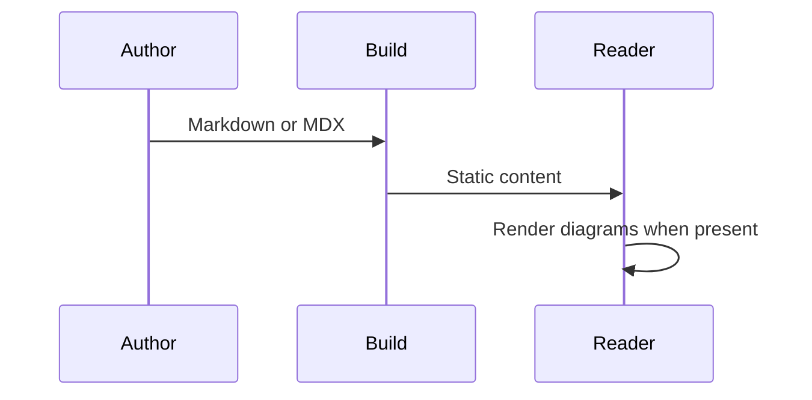
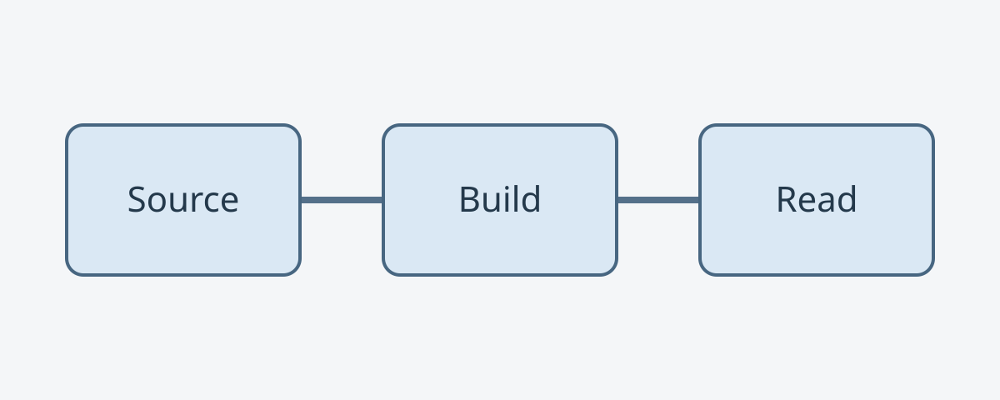

import Notice from 'astro-book/components/Notice';

MDX adds imports and components to a Markdown document. It keeps the same math, diagram and code pipeline as ordinary Markdown. This page imports only an Astro component and does not hydrate React.

## Component composition

<Notice>
  An Astro component can appear inside MDX without installing a client framework.
</Notice>

## Formulas

The same configured macro renders in MDX: $x \in \RR$ and $E = mc^2$.

$$
\int_0^1 x^2\,dx = \frac{1}{3}
$$

A long expression remains within its own scrolling region:

$$
f(x_1,x_2,x_3,x_4,x_5,x_6,x_7,x_8)=\sum_{i=1}^{8}x_i^2+\prod_{i=1}^{8}(1+x_i)+\frac{\partial^2 f}{\partial x_1\partial x_2}+\frac{\partial^2 f}{\partial x_3\partial x_4}
$$

## Diagrams



An invalid graph also preserves its source in MDX:

```mermaid
flowchart LR
  A[Unclosed label --> B
```

## Highlighted code

```astro
---
import Notice from 'astro-book/components/Notice';
---
<Notice>Framework-neutral content component</Notice>
```

## Wide tables

| Format | Formula rendering | Diagrams | Highlighting | Framework requirement |
| :-- | :-- | :-- | :-- | :-- |
| Markdown | Build-time KaTeX with shared macros | Lazy runtime with source fallback | Shared light/dark Shiki configuration | None |
| MDX | Build-time KaTeX with the same shared macros | The same lazy runtime and source fallback | The same light/dark Shiki configuration | None for Astro components |

## Native HTML

<details>
  <summary>MDX native HTML</summary>
  <p>MDX uses JSX syntax for HTML and retains the same reading styles.</p>
</details>

## Image zoom

Click this synthetic, locally bundled SVG to open the theme image viewer.


