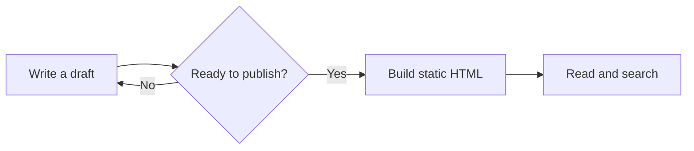
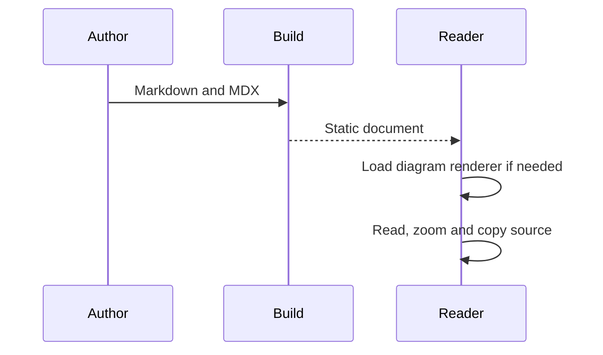
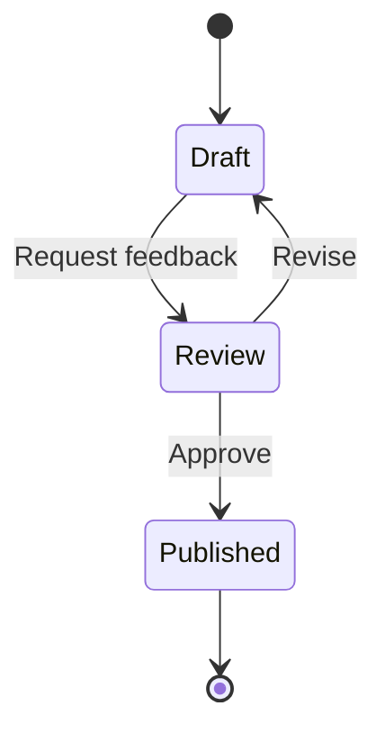

## A flowchart

A `mermaid` fence describes a diagram using text. The browser loads Mermaid only when a page contains a diagram.



The copy button returns the Mermaid source, even after the picture appears. Try changing the appearance mode to see the diagram follow the reading theme.

## A sequence diagram



## A state diagram



## Rendering and fallback

The generated HTML retains escaped diagram source. If JavaScript is disabled, the reader can still read it. If a diagram is invalid, the theme shows an error with the source instead of leaving an empty box.

<details>
<summary>Inspect an intentional syntax error</summary>

```mermaid
flowchart LR
  A[Unclosed label --> B
```

</details>

Each diagram handles its own error; one invalid example does not prevent the other diagrams from rendering.

## Configuration

`astro.config.mjs`

```js
astroBook({
  mermaid: {
    flowchart: { useMaxWidth: false },
  },
});
```

Configuration must be serializable data. The theme keeps Mermaid's security level strict. Set `mermaid: false` in the integration to display fences as source without rendering diagrams.

For diagram syntax, see the [official Mermaid documentation](https://mermaid.js.org/intro/).
